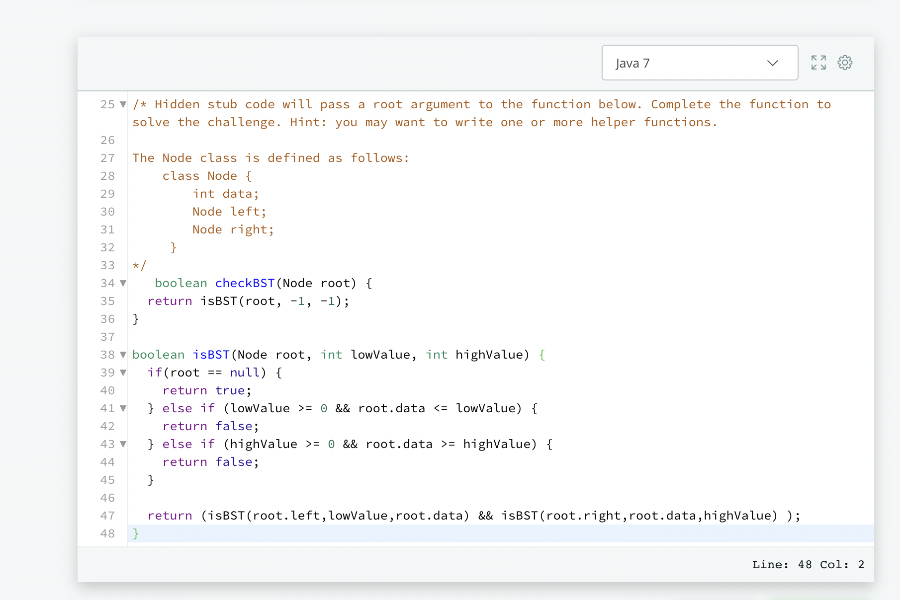
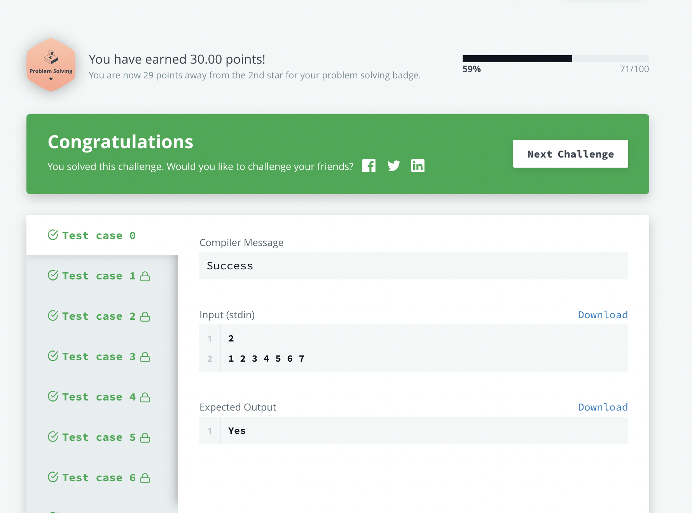

# ecommerce-api

## Getting Started

### Reference Documentation
This is a project to demonstrate RESTful API with Adonis Js . The task is to build an Ecommerce Api.
you can find the hosted documentation @ [E-COMMERCE DOCS](https://documenter.getpostman.com/view/7638519/UVC2HoyZ)

### DEVELOPMENT

#### ENVIRONMENT VARIABLE.
The required environment variables can be gotten from the env.example file. Please note that all properties in
the env.example file must be set. Simply create a new file called .env and copy past the content of `env.example` into the `.env` file.
[Api documentation](https://documenter.getpostman.com/view/7638519/UVC2HoyZ)

### Hackerank code solution: 

 

### hackerank result: 

 

